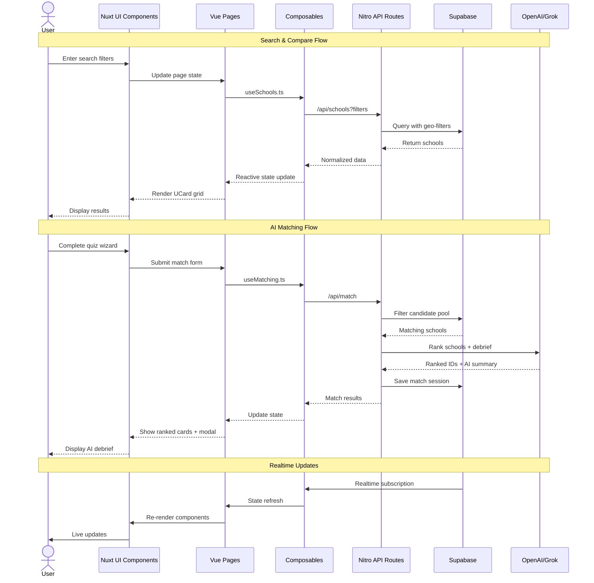
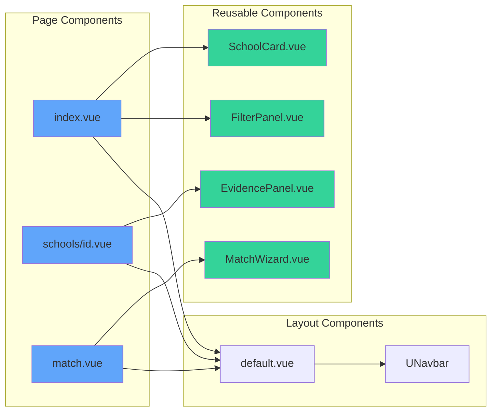
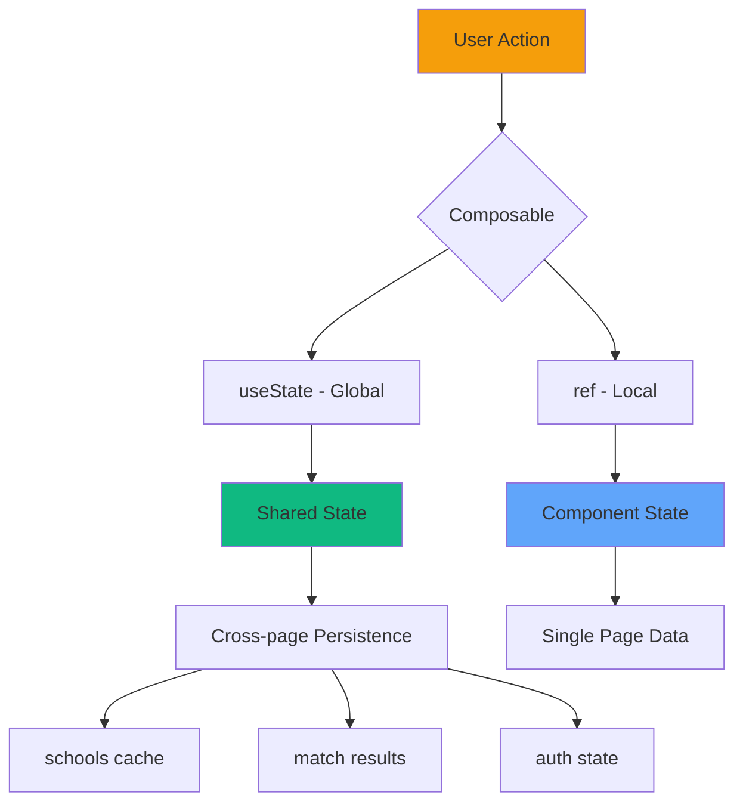
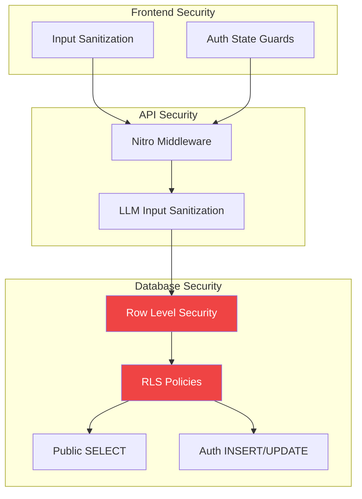
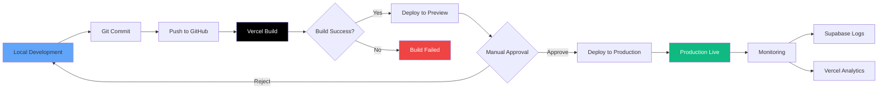
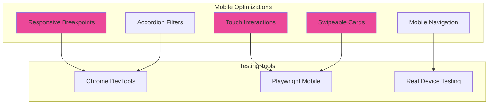
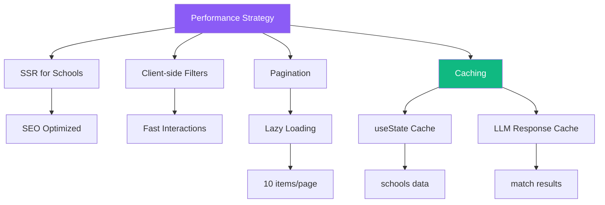
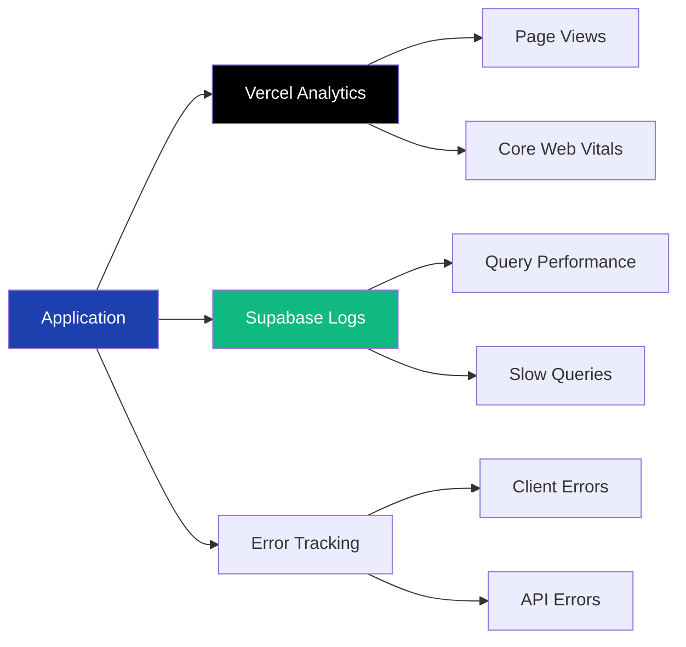

# Flysch Architecture

## System Architecture Overview

This document visualizes the complete architecture of the Flysch Flight School Marketplace MVP, including the tech stack, data flow, and system components.

## Technology Stack Diagram

```mermaid
graph TB
    subgraph "Client Layer"
        A[Browser/Mobile Client]
        A1[Nuxt 4 SSR/SSG]
        A --> A1
    end

    subgraph "Presentation Layer - Nuxt UI Components"
        B1[UTable - Filter/Compare]
        B2[UCard - School Profiles]
        B3[UForm - Quiz Wizard]
        B4[UModal - AI Debrief]
        B5[UMap - Leaflet Geo]
        B6[UBadge - Trust Tiers]
        A1 --> B1
        A1 --> B2
        A1 --> B3
        A1 --> B4
        A1 --> B5
        A1 --> B6
    end

    subgraph "Application Layer - Vue Pages"
        C1[index.vue - Search & Compare]
        C2[schools/id.vue - Profile]
        C3[match.vue - AI Matching]
        C4[login.vue - Auth]
        B1 --> C1
        B2 --> C2
        B3 --> C3
        B4 --> C3
        B5 --> C1
        B6 --> C2
    end

    subgraph "Logic Layer - Composables"
        D1[useSchools.ts]
        D2[useMatching.ts]
        D3[useTiers.ts]
        D4[useState - Global State]
        C1 --> D1
        C2 --> D1
        C3 --> D2
        C2 --> D3
        D1 --> D4
        D2 --> D4
    end

    subgraph "API Layer - Nitro Server Routes"
        E1[/api/schools.ts]
        E2[/api/seed.ts]
        E3[/api/match.ts]
        D1 --> E1
        D2 --> E3
    end

    subgraph "Backend Services"
        F1[Supabase]
        F2[OpenAI/Grok API]
        
        subgraph "Supabase Services"
            F1A[PostgreSQL + PostGIS]
            F1B[Auth]
            F1C[Realtime]
            F1D[Storage]
            F1 --> F1A
            F1 --> F1B
            F1 --> F1C
            F1 --> F1D
        end
    end

    subgraph "Database Schema"
        G1[(schools)]
        G2[(users)]
        G3[(inquiries)]
        G4[(match_sessions)]
        F1A --> G1
        F1A --> G2
        F1A --> G3
        F1A --> G4
    end

    subgraph "External Data Sources"
        H1[FAA Part 142 Data]
        H2[AOPA Directory]
        H1 --> E2
        H2 --> E2
    end

    subgraph "Deployment"
        I1[Vercel Hosting]
        I2[GitHub Repo]
        I2 --> I1
        A1 -.deployed to.-> I1
    end

    E1 --> F1
    E2 --> F1
    E3 --> F1
    E3 --> F2
    D1 --> F1C
    C4 --> F1B

    style A fill:#1E40AF,color:#fff
    style A1 fill:#1E40AF,color:#fff
    style F1 fill:#10B981,color:#fff
    style F2 fill:#F59E0B,color:#fff
    style I1 fill:#000,color:#fff
```

## Data Flow Diagram



## Component Architecture



## State Management Flow



## Security Architecture



## Deployment Pipeline



## Mobile Architecture



## Performance Architecture



## Key Architectural Decisions

### 1. Hybrid Rendering (Nuxt 4)
- **SSR** for school profile pages (SEO, performance)
- **Client-side** for interactive features (filters, AI matching)
- **SSG** for static pages (about, help)

### 2. Composables-First Architecture
- All business logic in composables
- `useState` for global state (schools cache, match results)
- `ref`/`reactive` for component-local state
- No Vuex/Pinia needed for MVP

### 3. Backend-as-a-Service (Supabase)
- Zero custom backend code (except Nitro routes)
- PostgreSQL + PostGIS for geo-queries
- Row Level Security for data protection
- Realtime subscriptions for live updates

### 4. AI Integration Pattern
- Server-side LLM calls (API keys protected)
- Client sends inputs → Server calls OpenAI/Grok → Client receives results
- Fallback ranking algorithm if LLM fails
- Cache responses to minimize API costs

### 5. Mobile-First Design
- All components responsive by default
- Touch-optimized interactions
- Progressive enhancement for desktop features
- Tested with Playwright mobile emulation

### 6. Data Flow Pattern
```
User Input → Composable → Nitro API → Supabase/LLM → Composable → Reactive Update → UI Re-render
```

### 7. Security Layers
1. Input sanitization on client
2. Validation in Nitro middleware
3. RLS policies in Supabase
4. LLM input sanitization for injection prevention

## Technology Rationale

| Technology | Purpose | Why Chosen |
|------------|---------|------------|
| **Nuxt 4** | Framework | Hybrid rendering, SEO, Vue 3 ecosystem |
| **Nuxt UI** | Component Library | Tailwind-based, accessible, rapid development |
| **Supabase** | Backend | PostgreSQL, Auth, Realtime, PostGIS support |
| **PostGIS** | Geo-queries | Radius searches, location-based filtering |
| **Leaflet** | Maps | Open-source, mobile-friendly, customizable |
| **OpenAI/Grok** | AI Matching | Smart ranking, natural language debrief |
| **VueUse** | Utilities | Composables for geolocation, storage, etc. |
| **Playwright** | E2E Testing | Mobile emulation, reliable, fast |
| **Vercel** | Hosting | Zero-config, auto-deploy, edge network |

## Scalability Considerations

### Current MVP
- ~100 schools (manageable in-memory caching)
- Single region deployment
- Basic pagination (10 items/page)

### Future Scale (Post-MVP)
- Add Redis for caching
- Implement CDN for static assets
- Database read replicas for geo-distributed queries
- Queue system for batch data updates
- Advanced search with Algolia/Typesense
- Multi-region deployment

## Monitoring & Observability



